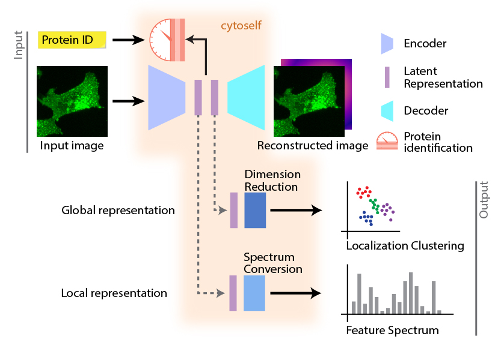

# cytoself


[](https://github.com/python/black)
[](https://pypi.org/project/cytoself)
[](https://python.org)
[](https://doi.org/10.1101/2021.03.29.437595)
[](https://opensource.org/licenses/BSD-3-Clause)


### Self-supervised deep learning encodes high-resolution features of protein subcellular localization

cytoself is a self-supervised model that we developed for learning features of protein subcellular localization from microscopy images. 
This model is described in detail in our paper [[1]](https://www.nature.com/articles/s41592-022-01541-z).
The image representations derived from cytoself encapsulate highly specific features that can derive functional insights for 
proteins on the sole basis of their localization.

Applying cytoself to images of endogenously labeled proteins from the recently released 
[OpenCell](https://opencell.czbiohub.org) database creates a highly resolved protein localization atlas
[[2]](https://www.science.org/doi/10.1126/science.abi6983). 

[1] Kobayashi, Hirofumi, _et al._ "Self-Supervised Deep-Learning Encodes High-Resolution Features of Protein 
Subcellular Localization." _Nature Methods_ (2022).
https://www.nature.com/articles/s41592-022-01541-z <br />
[2] Cho, Nathan H., _et al._ "OpenCell: Endogenous tagging for the cartography of human cellular organization." 
_Science_ 375.6585 (2022): eabi6983.
https://www.science.org/doi/10.1126/science.abi6983


## How cytoself works
cytoself uses images and an associated identity information (ID) as a label to learn the localization patterns of proteins.
When applied to OpenCell we used cell images where individual proteins are endogenously tagged per image. For each image we know which 
protein is tagged and that is the ID used. Our model implicitely learns to ignore image differences for images that 
are associated to the same ID, and tries its best to tell images apart if they are associated to different IDs. In practice cytoself
can resolve very fine textural differences between image classes but also can ignore very complex sources of image variability 
such as cell shapes, states, etc...




## What's in this repository
This repository offers three main components: 
[`DataManager`](https://github.com/royerlab/cytoself/blob/df0e421aa291879275582c51119cbd0319b2a004/cytoself/data_loader/data_manager.py#L6), 
[`cytoself.models`](https://github.com/royerlab/cytoself/tree/main/cytoself/models), 
and 
[`Analytics`](https://github.com/royerlab/cytoself/blob/df0e421aa291879275582c51119cbd0319b2a004/cytoself/analysis/analytics.py#L18).

[`DataManager`](https://github.com/royerlab/cytoself/blob/df0e421aa291879275582c51119cbd0319b2a004/cytoself/data_loader/data_manager.py#L6) 
is a simple module to handle train, validate and test data. 
You may want to modify it to adapt to your own data structure.
This module is in 
[`cytoself.data_loader.data_manager`](https://github.com/royerlab/cytoself/blob/main/cytoself/data_loader/data_manager.py).

[`cytoself.models` ](https://github.com/royerlab/cytoself/tree/main/cytoself/models)
contains modules for three different variants of the cytoself model: 
a model without split-quantization, a model without the pretext task, and the 'full' model (refer to our preprint for details about these variants). 
There is a submodule for each model variant that provides methods for constructing, compiling, and training the models (which are built using tensorflow).

`Analytics` is a simple module to perform analytic processes such as dimension reduction and plotting. 
You may want to modify it too to perform your own analysis. This module is in 
[`cytoself.analysis.analytics`](https://github.com/royerlab/cytoself/blob/main/cytoself/analysis/analytics.py). 
[](https://colab.research.google.com/github/royerlab/cytoself/blob/main/examples/simple_example.ipynb)

Pre-trained model weights are included in the [example script](
https://github.com/royerlab/cytoself/blob/02b52fd4c2ab0db12fbd9d68314252e63d73e2e4/examples/simple_example.py#L16-L20
).

**Note: Cytoself will migrate to pytorch implementation in the near future.**


## Installation
Recommended: create a new environment and install cytoself on the environment from pypi
```shell script
conda create -y -n cytoself python=3.7
conda activate cytoself
pip install cytoself
```

### (Option) Install TensorFlow GPU
If your computer is equipped with GPUs that support Tensorflow 1.15, you can install Tensorflow-gpu to utilize GPUs.
Install the following packages before cytoself, or uninstall the existing CPU versions and reinstall the GPU versions 
again with conda.
```shell script
conda install -y h5py=2.10.0 tensorflow-gpu=1.15
```

### For developers

You can also install cytoself from this GitHub repository.

```shell script
git clone https://github.com/royerlab/cytoself.git
pip install .
```

### Troubleshooting

In case of getting errors in the installation, run the following code inside the cytoself folder to manually install 
the dependencies.

```shell
pip install -r requirements.txt
```

As a reference for a complete dependency, a snapshot of a working environment can be found in 
[`environment.yml`](https://github.com/royerlab/cytoself/blob/main/environment.yml)


## Example script (How to use cytoself)
A minimal example script is in 
[`example/simple_training.py`](https://github.com/royerlab/cytoself/blob/main/examples/simple_example.py).
Learn how to use cytoself through 
[](https://colab.research.google.com/github/royerlab/cytoself/blob/main/examples/simple_example.ipynb)

Test if this package runs in your computer with command 
```shell script
python examples/simple_example.py
```


## Computational resources
It is highly recommended to use a GPU to run cytoself. 
For example, a full model with image shape of (100, 100, 2) and batch size 64 can take ~9GB of GPU memory.


## Tested Environment
Google Colab (CPU/GPU/TPU)

macOS 10.14.6, RAM 32GB (CPU)

Windows10 Pro 64bit, RTX 1080Ti, CUDA 11.6 (CPU/GPU)

Ubuntu 18.04.6 LTS, RTX 2080Ti, CUDA 11.2 (CPU/GPU)


## Data Availability

### Pretrained model
Pre-trained models used in the [paper](https://www.nature.com/articles/s41592-022-01541-z). 
Please follow the [example script](https://github.com/royerlab/cytoself/blob/main/examples/simple_example.py) 
or [](https://colab.research.google.com/github/royerlab/cytoself/blob/main/examples/simple_example.ipynb)
to lean how to use a pre-trained model.

[model_protein_nucleardistance.h5](https://drive.google.com/file/d/1gkiEMKdadOel4Xh6KoS2U603JTkZhgDw/view?usp=sharing)
: The model trained on target protein and nuclear distance. <br/>
[model_protein.h5](https://drive.google.com/file/d/1mgfWlqcS0gWtu7FrAywcwmdvme856d4v/view?usp=sharing)
: The model trained on target protein alone.  <br/>
[model_protein_nucleus.h5](https://drive.google.com/file/d/1p69hDlIw4DKeNIFhuwoLRWoOeoLDsLoB/view?usp=sharing)
: The model trained on target protein and nucleus.

The full data of image and protein label used in this work can be found here.
The image data have the shape of `[batch, 100, 100, 4]`, in which the last channel dimension corresponds to `[target 
protein, nucleus, nuclear distance, nuclear segmentation]`.


### Embeddings

The embedding vectors of global representations and their labels are available from the following links.
Due to their large size, only embeddings extracted from test data are provided.

[Global_representation.npy](https://drive.google.com/file/d/1s9TL72912HH947SFWcO6tClF91xDOEEi/view?usp=sharing)  In the shape of 114,806 images x 9,216 latent dimensions. (3.9 GB) <br/>
[label.csv](https://drive.google.com/file/d/1fl0lcrZCOkdN2vwXQSHe7i1MC04RXCiE/view?usp=sharing)  114,806 rows x 7 columns. (6.2 MB)

### Image and label data

Due to the large size, the whole data is split to 10 files. The files are intended to be concatenated together to 
form one large numpy file or one large csv.

[Image_data00.npy](https://drive.google.com/file/d/15_CHBPT-p5JG44acP6D2hKd8jAacZatp/view?usp=sharing)  
[Image_data01.npy](https://drive.google.com/file/d/1m7Cj2OALiZTIiHpvb9zFPG_I3j1wRnzK/view?usp=sharing)  
[Image_data02.npy](https://drive.google.com/file/d/17nknzqlcYO3n9bAe4FwGVPkU-mJAhQ4j/view?usp=sharing)  
[Image_data03.npy](https://drive.google.com/file/d/1vEsddF68dyOda-hwI-ptAL4vShBGl98Y/view?usp=sharing)  
[Image_data04.npy](https://drive.google.com/file/d/1aB7WaRuhobG_IDl0l_PPeSJAxCYy-Pye/view?usp=sharing)  
[Image_data05.npy](https://drive.google.com/file/d/1qb0waKcLprDtuFAdCec3WegWkmd-U45A/view?usp=sharing)  
[Image_data06.npy](https://drive.google.com/file/d/1y-1vlfZ4eNhvTvpuqTZVL8DvSwYX3CH_/view?usp=sharing)  
[Image_data07.npy](https://drive.google.com/file/d/1ejcPdh-d5lB1OcZ6x8SJx61pEUioZvB2/view?usp=sharing)  
[Image_data08.npy](https://drive.google.com/file/d/1DOicAkruNsU5F4DWLzO2QrV6xU4kuVxs/view?usp=sharing)  
[Image_data09.npy](https://drive.google.com/file/d/1a5YyHeRSRdJStG3KnFe2vsNjrsit9zbf/view?usp=sharing)  
[Label_data00.csv](https://drive.google.com/file/d/1CVwvXW2KhVBbTBixwRXIIiMhrlGDXz-4/view?usp=sharing)  
[Label_data01.csv](https://drive.google.com/file/d/1mTYe5icvWXNfY5wEsuQUhSwgtefBJpjg/view?usp=sharing)  
[Label_data02.csv](https://drive.google.com/file/d/1HckmktklyPo6qbakrwtERsCT34mRdn7l/view?usp=sharing)  
[Label_data03.csv](https://drive.google.com/file/d/1GBxDmWcl_o49i4lGujA8EgIn5G4htkBr/view?usp=sharing)  
[Label_data04.csv](https://drive.google.com/file/d/1G4FpJnlqB3ejmdw3SF2w3DFYt8Wnq0fT/view?usp=sharing)  
[Label_data05.csv](https://drive.google.com/file/d/1Vo1J09qP2TAoXwltCF84socz2TPV92JU/view?usp=sharing)  
[Label_data06.csv](https://drive.google.com/file/d/1d7gJjLTQhOw-e9KZJY9pr6KOCIN8NBvp/view?usp=sharing)  
[Label_data07.csv](https://drive.google.com/file/d/1kr5EF0RA3ZwSXmoaBFwFDVnrokh2EaOE/view?usp=sharing)  
[Label_data08.csv](https://drive.google.com/file/d/1mXyedmLezzty2LSSH3asw0LQeu-ie9mz/view?usp=sharing)  
[Label_data09.csv](https://drive.google.com/file/d/1Vdv1cD75VhvC3FdKTen-5rqLJnWpHvmb/view?usp=sharing)  
