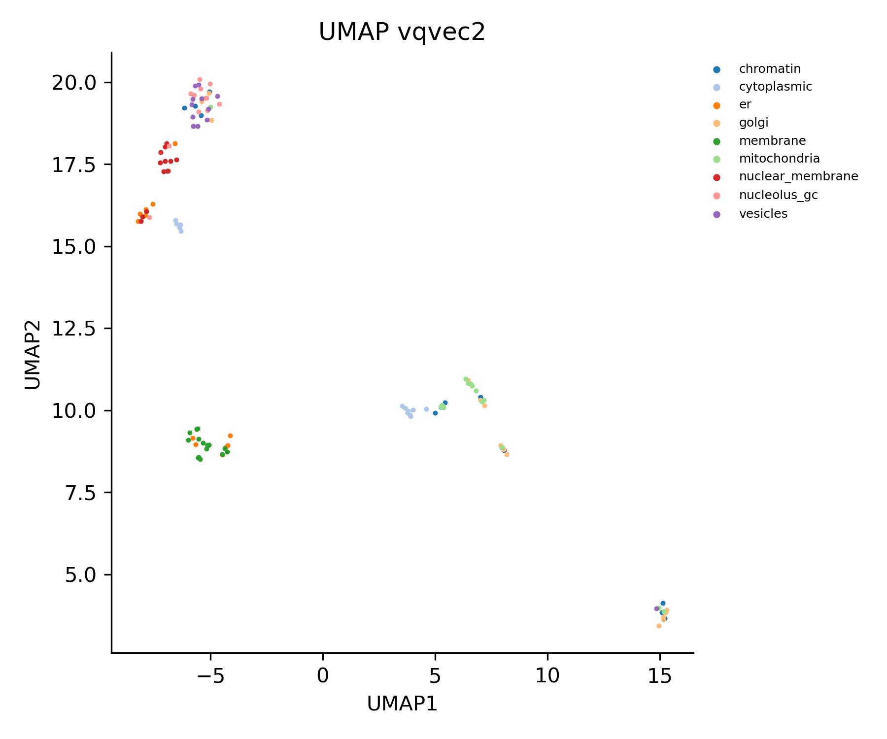

# cytoself_pytorch
cytoself in pytorch implementation

[](https://www.python.org/downloads/release/python-397/)
[](https://doi.org/10.1038/s41592-022-01541-z)
[](https://opensource.org/licenses/BSD-3-Clause)
[](https://github.com/python/black)
[](https://codecov.io/gh/royerlab/cytoself_pytorch)
[](https://github.com/royerlab/cytoself/actions/workflows/pytest-codecov-conda.yml)


cytoself is a self-supervised platform for learning features of protein subcellular localization from microscopy 
images [[1]](https://www.nature.com/articles/s41592-022-01541-z).
The representations derived from cytoself encapsulate highly specific features that can derive functional insights for 
proteins on the sole basis of their localization.

Applying cytoself to images of endogenously labeled proteins from the recently released 
[OpenCell](https://opencell.czbiohub.org) database creates a highly resolved protein localization atlas
[[2]](https://www.science.org/doi/10.1126/science.abi6983). 

[1] Kobayashi, Hirofumi, _et al._ "Self-Supervised Deep-Learning Encodes High-Resolution Features of Protein 
Subcellular Localization." _Nature Methods_ (2022).
https://www.nature.com/articles/s41592-022-01541-z <br />
[2] Cho, Nathan H., _et al._ "OpenCell: Endogenous tagging for the cartography of human cellular organization." 
_Science_ 375.6585 (2022): eabi6983.
https://www.science.org/doi/10.1126/science.abi6983


## How cytoself works
cytoself uses images (cell images where only single type of protein is fluorescently labeled) and its identity 
information (protein ID) as a label to learn the localization patterns of proteins.


## Installation
Recommended: create a new environment and install cytoself on the environment from pypi

(Optional) To run cytoself on GPUs, it is recommended to install pytorch GPU version before installing cytoself 
following the [official instruction](https://pytorch.org/get-started/locally/).
```shell script
conda create -y -n cytoself python=3.9
conda activate cytoself
# (Optional: Install pytorch GPU following the official instruction)
pip install cytoself
```

### (For the developers) Install from this repository
Make sure you are in the root directory of the repository.

```bash
pip install -e .
```

Install development dependencies

```bash
pip install -r requirements/development.txt
```


## How to use cytoself on the sample data 
Download one set of the image and label data from [Data Availability](##Data Availability)


### 1. Prepare Data

```python
from cytoself.datamanager.opencell import DataManagerOpenCell

data_ch = ['pro', 'nuc']
datapath = 'sample_data'  # path to download sample data
DataManagerOpenCell.download_sample_data(datapath)  # donwload data
datamanager = DataManagerOpenCell(datapath, data_ch, fov_col=None)
datamanager.const_dataloader(batch_size=32, label_name_position=1)
```
A folder, `sample_data`, will be created and sample data will be downloaded to this folder.
The `sample_data` folder will be created in the "current working directory," which is where you are running the code. 
Use `os.getcwd()` to check where the current working directory is.

9 sets of data with 4 files for each protein (in total 36 files) will be downloaded. 
The file name is in the form of `<protein_name>_<channel or label>.npy`.  

* **`*_label.npy` file**:
Contains label information in 3 columns, i.e. Ensembl ID, protein name and localization.
* **`*_pro.npy` file**:
Image data of protein channel. Size 100x100. Images were cropped with nucleus being centered 
(see details in [paper](https://doi.org/10.1038/s41592-022-01541-z)).
* **`*_nuc.npy` file**:
Image data of nucleus channel. Size 100x100. Images were cropped with nucleus being centered 
(see details in [paper](https://doi.org/10.1038/s41592-022-01541-z)).
* **`*_nucdist.npy` file**:
Data of nucleus distance map. Size 100x100. Images were cropped with nucleus being centered 
(see details in [paper](https://doi.org/10.1038/s41592-022-01541-z)).


### 2. Create and train a cytoself model

```python
from cytoself.trainer.cytoselflite_trainer import CytoselfFullTrainer

model_args = {
    'input_shape': (2, 100, 100),
    'emb_shapes': ((25, 25), (4, 4)),
    'output_shape': (2, 100, 100),
    'fc_output_idx': [2],
    'vq_args': {'num_embeddings': 512, 'embedding_dim': 64},
    'vq_args': {'num_embeddings': 512},
    'num_class': len(datamanager.unique_labels),
    'fc_input_type': 'vqvec',
}
train_args = {
    'lr': 1e-3,
    'max_epoch': 1,
    'reducelr_patience': 3,
    'reducelr_increment': 0.1,
    'earlystop_patience': 6,
}
trainer = CytoselfFullTrainer(train_args, homepath='demo_output', model_args=model_args)
trainer.fit(datamanager, tensorboard_path='tb_logs')
```

### 3. Plot UMAP
```python
from cytoself.analysis.analysis_opencell import AnalysisOpenCell

analysis = AnalysisOpenCell(datamanager, trainer)
umap_data = analysis.plot_umap_of_embedding_vector(
    data_loader=datamanager.test_loader,
    group_col=2,
    output_layer=f'{model_args["fc_input_type"]}2',
    title=f'UMAP {model_args["fc_input_type"]}2',
    xlabel='UMAP1',
    ylabel='UMAP2',
    s=0.3,
    alpha=0.5,
    show_legend=True,
)
```
The output UMAP plot will be saved at `demo_output/analysis/umap_figures/UMAP_vqvec2.png` by default.



## Tested Environments

Rocky Linux 8.6, NVIDIA A100, CUDA 11.7 (GPU)

Ubuntu 20.04.3 LTS, NVIDIA 3090, CUDA 11.4 (GPU)

## Data Availability
The full data used in this work can be found here.
The image data have the shape of `[batch, 100, 100, 4]`, in which the last channel dimension corresponds to `[target 
protein, nucleus, nuclear distance, nuclear segmentation]`.

Due to the large size, the whole data is split to 10 files. The files are intended to be concatenated together to 
form one large numpy file or one large csv.

[Image_data00.npy](https://drive.google.com/file/d/15_CHBPT-p5JG44acP6D2hKd8jAacZatp/view?usp=sharing)  
[Image_data01.npy](https://drive.google.com/file/d/1m7Cj2OALiZTIiHpvb9zFPG_I3j1wRnzK/view?usp=sharing)  
[Image_data02.npy](https://drive.google.com/file/d/17nknzqlcYO3n9bAe4FwGVPkU-mJAhQ4j/view?usp=sharing)  
[Image_data03.npy](https://drive.google.com/file/d/1vEsddF68dyOda-hwI-ptAL4vShBGl98Y/view?usp=sharing)  
[Image_data04.npy](https://drive.google.com/file/d/1aB7WaRuhobG_IDl0l_PPeSJAxCYy-Pye/view?usp=sharing)  
[Image_data05.npy](https://drive.google.com/file/d/1qb0waKcLprDtuFAdCec3WegWkmd-U45A/view?usp=sharing)  
[Image_data06.npy](https://drive.google.com/file/d/1y-1vlfZ4eNhvTvpuqTZVL8DvSwYX3CH_/view?usp=sharing)  
[Image_data07.npy](https://drive.google.com/file/d/1ejcPdh-d5lB1OcZ6x8SJx61pEUioZvB2/view?usp=sharing)  
[Image_data08.npy](https://drive.google.com/file/d/1DOicAkruNsU5F4DWLzO2QrV6xU4kuVxs/view?usp=sharing)  
[Image_data09.npy](https://drive.google.com/file/d/1a5YyHeRSRdJStG3KnFe2vsNjrsit9zbf/view?usp=sharing)  
[Label_data00.csv](https://drive.google.com/file/d/1CVwvXW2KhVBbTBixwRXIIiMhrlGDXz-4/view?usp=sharing)  
[Label_data01.csv](https://drive.google.com/file/d/1mTYe5icvWXNfY5wEsuQUhSwgtefBJpjg/view?usp=sharing)  
[Label_data02.csv](https://drive.google.com/file/d/1HckmktklyPo6qbakrwtERsCT34mRdn7l/view?usp=sharing)  
[Label_data03.csv](https://drive.google.com/file/d/1GBxDmWcl_o49i4lGujA8EgIn5G4htkBr/view?usp=sharing)  
[Label_data04.csv](https://drive.google.com/file/d/1G4FpJnlqB3ejmdw3SF2w3DFYt8Wnq0fT/view?usp=sharing)  
[Label_data05.csv](https://drive.google.com/file/d/1Vo1J09qP2TAoXwltCF84socz2TPV92JU/view?usp=sharing)  
[Label_data06.csv](https://drive.google.com/file/d/1d7gJjLTQhOw-e9KZJY9pr6KOCIN8NBvp/view?usp=sharing)  
[Label_data07.csv](https://drive.google.com/file/d/1kr5EF0RA3ZwSXmoaBFwFDVnrokh2EaOE/view?usp=sharing)  
[Label_data08.csv](https://drive.google.com/file/d/1mXyedmLezzty2LSSH3asw0LQeu-ie9mz/view?usp=sharing)  
[Label_data09.csv](https://drive.google.com/file/d/1Vdv1cD75VhvC3FdKTen-5rqLJnWpHvmb/view?usp=sharing)  
